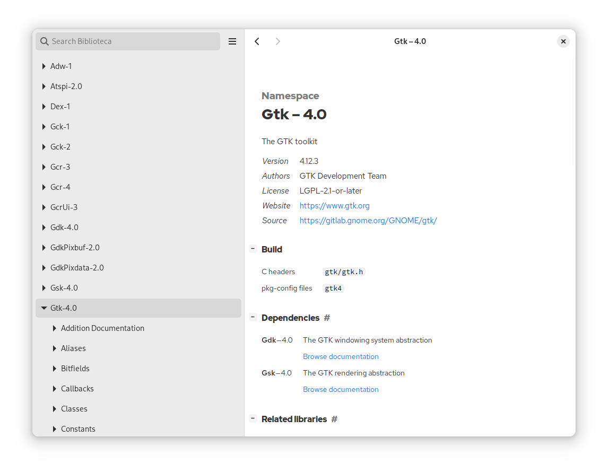

# Biblioteca

Documentation viewer for GNOME.

<a href='https://flathub.org/apps/app.drey.Biblioteca'></a>

Biblioteca lets you browse and read GNOME documentation.

Among other things, Biblioteca comes with

- Offline documentation
- Dark mode support
- Fuzzy search
- Mobile / adaptive

ℹ️ Biblioteca is made possible by Flatpak. Only Flathub Biblioteca is supported.



## History

Biblioteca originally started as a built-in offline documentation viewer for [Workbench](https://github.com/workbenchdev/Workbench). It was built by Akshay Warrier as a "stretch-goal" of [his 2023 GSoC internship](https://akshaywarrier.medium.com/) under the mentorship of Andy Holmes and Sonny Piers.

The offline documentation viewer has been extracted into a standalone repository/app and became Biblioteca.

Akshay and Sonny keep maintaining this project.

## Code of conduct

Biblioteca follows the [GNOME Code of Conduct](https://conduct.gnome.org/).

- **Be friendly.** Use welcoming and inclusive language.
- **Be empathetic.** Be respectful of differing viewpoints and experiences.
- **Be respectful.** When we disagree, we do so in a polite and constructive manner.
- **Be considerate.** Remember that decisions are often a difficult choice between competing priorities.
- **Be patient and generous.** If someone asks for help it is because they need it.
- **Try to be concise.** Read the discussion before commenting.

## License

License
GPLv3. Please see the [COPYING](./COPYING) file.

<details>

  <summary>Maintenance</summary>

## How to release?

```sh
version=1.0
cd Biblioteca # this repo
# update version in meson.build
# add or update the release in data/app.metainfo.xml
git add meson.build data/app.meta.info.xml
git commit -m v$version # it's a convention to prefix version tags with "v"
git push
git tag v$version
git push -u origin v$version

cd ../app.drey.Biblioteca/ # https://github.com/flathub/app.drey.Biblioteca/
git checkout -b v$V # It's not possible to push to master on flathub
cp ../Biblioteca/build-aux/app.drey.Biblioteca.json . # copy the release manifest
# update the commit and tag in the app.drey.Biblioteca.json
cp -r ../Biblioteca/build-aux/modules . # copy the modules
git add .
git commit -m v$version
git push
```

It will trigger a "Test" build on https://buildbot.flathub.org/#/apps/app.drey.Biblioteca

Once the build is successful, you'll be able to test it and merge the PR into main.

It will trigger an "Official" build on https://buildbot.flathub.org/#/apps/app.drey.Biblioteca

It will eventually be published but if you don't want to wait you can login Buildbot, select the "Official" build and click the "Publish" button.

</details>
