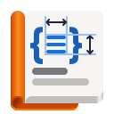

# Biblioteca

Documentation viewer for GNOME.

<!--  -->

Biblioteca lets you browse and read GNOME documentation.

Among other things, Biblioteca comes with

- Offline documentation
- Dark mode support
- Fuzzy search
- Platform Tools

ℹ️ Biblioteca is made possible by Flatpak. Only Flathub Biblioteca is supported.

## History

Biblioteca originally started as a built-in offline documentation viewer for [Workbench](https://github.com/sonnyp/Workbench). It was built by Akshay Warrier as a "stretch-goal" of [his 2023 GSoC internship](https://akshaywarrier.medium.com/) under the mentorship of Andy Holmes and Sonny Piers.

The offline docunmetation viewer has been extracted into a standalone repository/app and became Biblioteca.

Akshay and Sonny keep maintaining this project.

## License

License
GPLv3. Please see the [COPYING](./COPYING) file.
